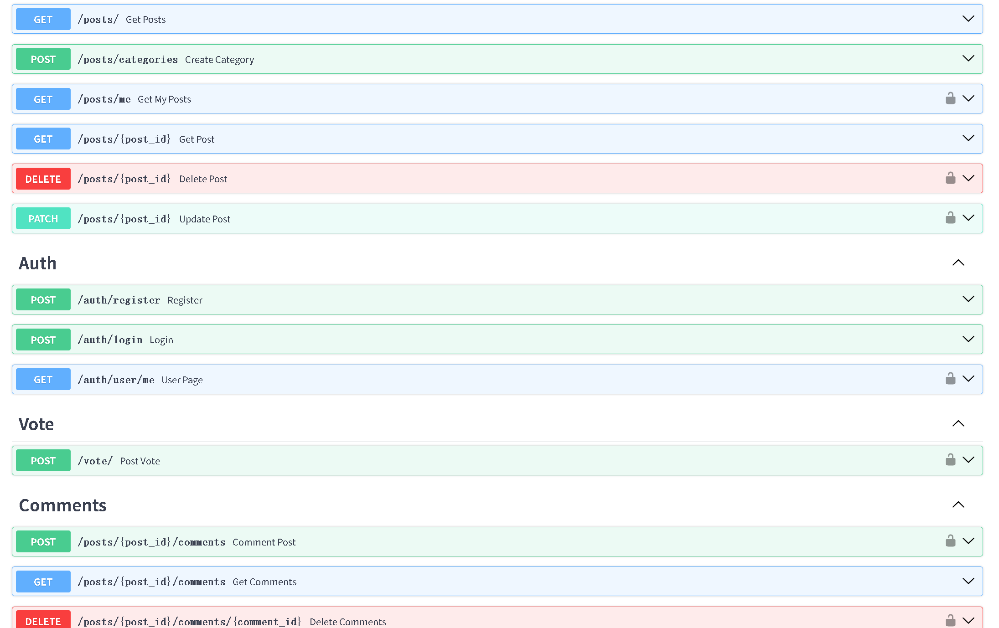
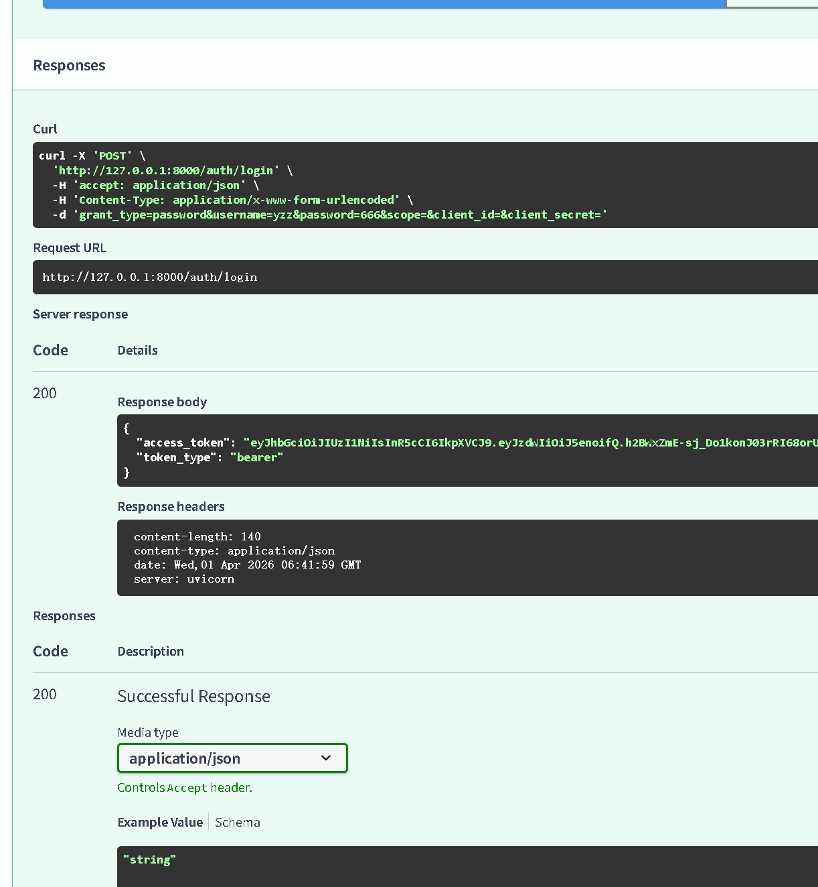
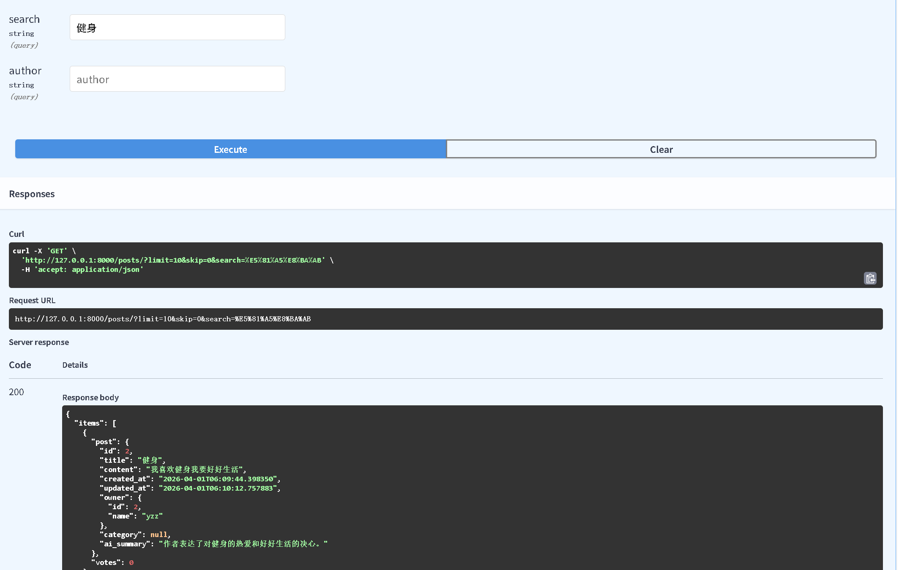

# 基于 FastAPI 的内容社区后端

这是一个我用 FastAPI 做的内容社区后端项目。  
项目主要围绕常见业务后端场景展开，包括用户注册登录、帖子发布、评论、点赞、搜索、分页和鉴权等功能。

这个项目的重点是把一个比较完整的社区后端链路走通，而不是只做几个简单的 CRUD 接口。

---

## 项目特点

- 支持用户注册、登录和 JWT 鉴权
- 支持发帖、更新、评论、点赞等社区基础功能
- 支持分类、搜索和分页
- 使用 SQLAlchemy 处理多表关系与查询
- 支持帖子摘要自动生成和失败兜底逻辑

---

## 技术栈

- Python
- FastAPI
- SQLAlchemy
- Pydantic
- SQLite
- JWT

---

## 主要功能

### 1. 用户与鉴权
- 用户注册与登录
- JWT 鉴权
- 基础权限控制

### 2. 内容社区功能
- 发布帖子
- 更新帖子
- 评论
- 点赞
- 分类管理

### 3. 查询能力
- 支持搜索
- 支持分页
- 支持帖子详情加载

### 4. 业务处理
- 使用 relationship 处理数据关系
- 使用 joinedload 优化部分查询
- 评论支持逻辑删除
- 帖子支持 AI 摘要生成与失败兜底

---

## 项目结构

```text
.
├── main.py
├── config.py
├── database.py
├── models.py
├── schemas.py
├── routers/
│   ├── auth.py
│   ├── posts.py
│   ├── comments.py
│   └── ...
└── services/

```

## 主要接口

### 用户相关
- `POST /auth/register/`
- `POST /auth/login/`
- `POST /auth/user/me/`

### 帖子相关
- `POST /posts/`
- `GET /posts/`
- `GET /posts/me/`
- `GET /posts/{post_id}/`
- `PATCH /posts/{post_id}/`
- `DELETE /posts/{post_id}/`
- `POST /posts/categories/`

### 评论与点赞相关
- `POST /posts/{post_id}/comments/`
- `GET /posts/{post_id}/comments/`
- `DELETE /posts/{post_id}/comments/{comment_id}/`
- `POAT /vote/`


## 项目截图

### 接口概览


### 登录与鉴权


### 搜索与分页



## 测试示例
可以测试这些典型流程：

- 注册用户
- 登录获取 token
- 使用 token 发帖
- 评论帖子
- 点赞帖子
- 搜索帖子并分页查看结果


## 这个项目里我自己实现的部分

这个项目里我主要自己完成了这些部分：

- 注册登录与 JWT 鉴权
- 帖子、评论、点赞相关接口
- 搜索与分页逻辑
- SQLAlchemy 多表关系与查询处理
- 评论逻辑删除
- 帖子摘要生成与失败兜底

这个项目让我更熟悉了标准业务后端里常见的鉴权、数据关系和接口设计问题。


## 本地运行

### 1. 安装依赖

```bash
pip install -r requirements.txt

### 2. 配置 .env
DATABASE_URL = "sqlite:///./test.db"
GEMINI_API_KEY = your_api_key

### 3. 启动项目
python -m uvicorn main:app --reload

```